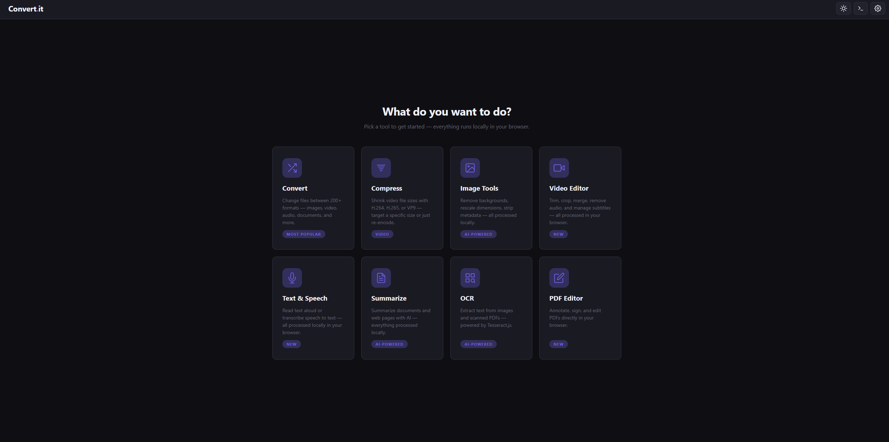
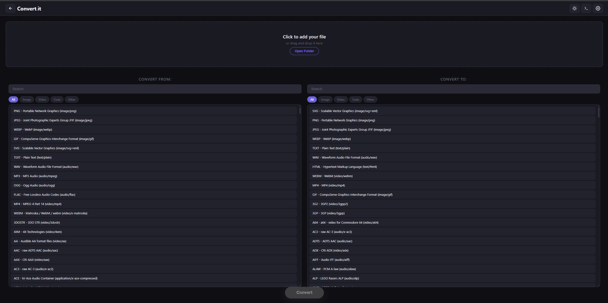
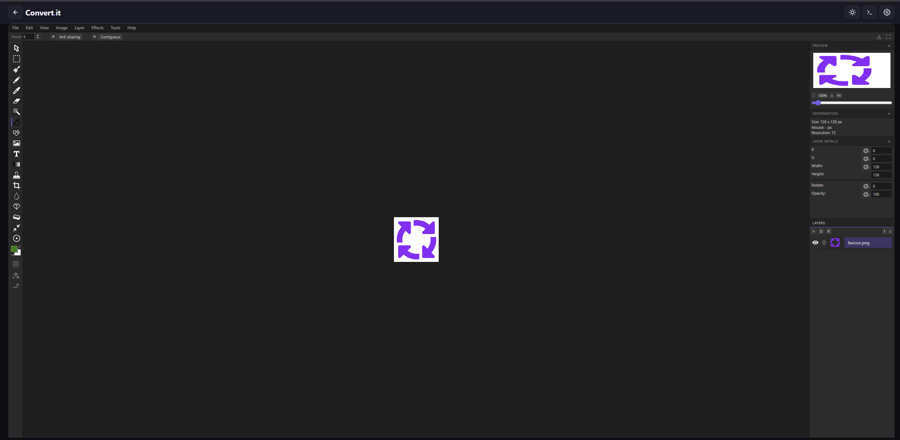

<!-- Purple gradient banner -->

 

 

**Everything runs locally in your browser.** No uploads, no servers, no accounts. 
Powered by WebAssembly and on-device AI.

 

 

---

 

## What is Convert.it?

Most online converters are limited, insecure, and boring. They only handle conversions within the same media type and force you to upload your files to some random server.

**Convert.it is different** — it processes everything locally using WebAssembly and on-device AI, supports cross-medium conversions, and packs a full suite of creative tools without ever touching a server.

Need to turn an AVI into a PDF? Extract text from a scanned document? Generate speech from text? Edit a PDF? Go for it.

 

---

 

## Tools

<table>
<tr>
<td width="50%" valign="top">

### Convert
> **200+ file formats** across every media type

Change files between images, video, audio, documents, archives, fonts, 3D models, game assets, and more. Auto-detects input format with batch conversion and category queueing. Simple mode for everyday use, Advanced mode for power users.

</td>
<td width="50%" valign="top">

### Compress
> **Video compression** with precision control

Re-encode videos with quality control and target file size constraints. Supports H.264, H.265, VP9 codecs with presets for Discord, Twitter/X, or custom targets. Output as MP4 or WebM.

</td>
</tr>
<tr>
<td width="50%" valign="top">

### Image Tools
> **AI-powered** image manipulation

Background removal via on-device RMBG-1.4 (WebGPU/WASM) or remove.bg API with correction mode for text and fine details. AI image generation and editing via OpenRouter API. Plus rescaling with aspect ratio lock and metadata stripping.

</td>
<td width="50%" valign="top">

### Video Editor
> **Full-featured** in-browser editing

Trim, crop, merge, and manage audio with a 5-band parametric EQ. Extract, burn, or AI-generate subtitles with Whisper in 15 languages. Hardware-accelerated WebCodecs where available.

</td>
</tr>
<tr>
<td width="50%" valign="top">

### Text & Speech
> **Neural TTS** and **Whisper STT**

28 neural voices (Kokoro 82M) across American and British accents with speed control and fullscreen read-aloud mode. Speech-to-text with 4 Whisper model sizes and word-level timestamps.

</td>
<td width="50%" valign="top">

### Summarize
> **AI-powered** document summarization

Summarize PDFs, DOCX, text, or web pages with DistilBART/BART models. Smart chunking handles long documents automatically. Adjustable target length from 50–500 words.

</td>
</tr>
<tr>
<td width="50%" valign="top">

### OCR
> **Tesseract.js** text extraction

Extract text from images and scanned PDFs in 14 languages. Multi-page PDF support with live preview. Includes fullscreen read-aloud mode with Kokoro TTS integration.

</td>
<td width="50%" valign="top">

### PDF Editor
> **Annotate, sign, and edit** in-browser

6 tools: select, text (20 fonts with auto-style matching), draw, highlight, erase, and image insertion. Per-page undo/redo, zoom, and live thumbnail sidebar.

</td>
</tr>
</table>

 

 
<b>Universal converter</b> — 200+ formats with searchable format picker and category filters

 

---

 

## Supported Formats

| Category | Examples |
|:---|:---|
| **Image** | PNG, JPEG, WebP, GIF, SVG, TIFF, BMP, ICO, HEIF, AVIF, JP2, JXL, QOI, VTF, Aseprite, and 50+ more |
| **Video** | MP4, AVI, MKV, WebM, MOV, FLV, and 100+ FFmpeg formats |
| **Audio** | MP3, WAV, OGG, FLAC, AAC, MIDI, MOD, XM, S3M, IT, QOA, and more |
| **Document** | PDF, DOCX, XLSX, PPTX, HTML, Markdown, EPUB, RTF, LaTeX, ODT, and 50+ via Pandoc |
| **Data** | JSON, XML, YAML, CSV, SQL, SQLite, NBT (Minecraft) |
| **Archive** | ZIP, 7Z, TAR, TAR.GZ, GZ, LZH |
| **3D Model** | GLB and other formats via Three.js |
| **Font** | TTF, OTF, WOFF, WOFF2 |
| **Game** | Doom WAD, Beat Saber replays (BSOR), Scratch 3.0 (SB3), Portal 2 (SPPD), Half-Life 2 (VTF) |
| **Other** | Base64, hex, URL encoding, Python turtle graphics, PE executables |

 

---

 

## Built-in Image Editor

 
<b>Full image editor</b> — layers, brushes, effects, selections, text, shapes, and AI generation

 

---

 

## Privacy & Security

<table>
<tr>
<td>

**100% client-side** — all processing runs in your browser using WebAssembly. Your files never leave your device unless you explicitly opt into remove.bg API, OpenRouter API (AI image generation), or CORS proxy. Privacy mode strips EXIF/GPS metadata, randomizes filenames, and hides referrer headers. No accounts, no tracking, no uploads.

</td>
</tr>
</table>

 

---

 

## Personalization

- Dark and light themes
- 8 preset accent colors + 3 custom color slots with full color picker
- Configurable defaults for every tool
- Auto-download toggle or collect files in the output tray

 

---

 

## Tech Stack

| Component | Technology |
|:---|:---|
| **Build** | TypeScript + Vite |
| **Video/Audio** | FFmpeg WASM |
| **Images** | ImageMagick WASM |
| **Documents** | Pandoc |
| **OCR** | Tesseract.js |
| **Text-to-Speech** | Kokoro TTS (82M params) |
| **Speech-to-Text** | Whisper via Transformers.js |
| **Summarization** | DistilBART / BART via Transformers.js |
| **Background Removal** | RMBG-1.4 via Transformers.js |
| **PDF** | pdfjs-dist + Fabric.js + pdf-lib |
| **3D Models** | Three.js |
| **Archives** | 7z-WASM, JSZip, pako |
| **Music Trackers** | libopenmpt |

 

---

 

## Usage

1. Go to **[convert.utoggl.in](https://convert.utoggl.in/)**
2. Pick a tool from the home screen or drop files anywhere
3. Configure your options and hit the action button
4. Download your result — or keep working

 

---

 

**GPL-2.0** &nbsp;|&nbsp; Fork of [**Convert**](https://github.com/p2r3/convert) by [p2r3](https://github.com/p2r3) &nbsp;|&nbsp; Image editor powered by [**miniPaint**](https://github.com/nicktrigger/miniPaint) by [nicktrigger](https://github.com/nicktrigger)

 

